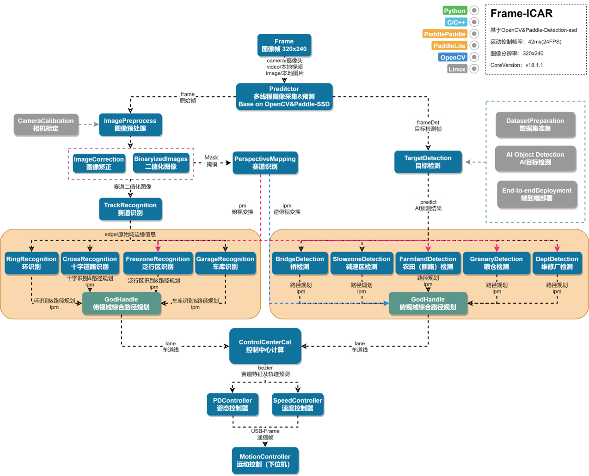
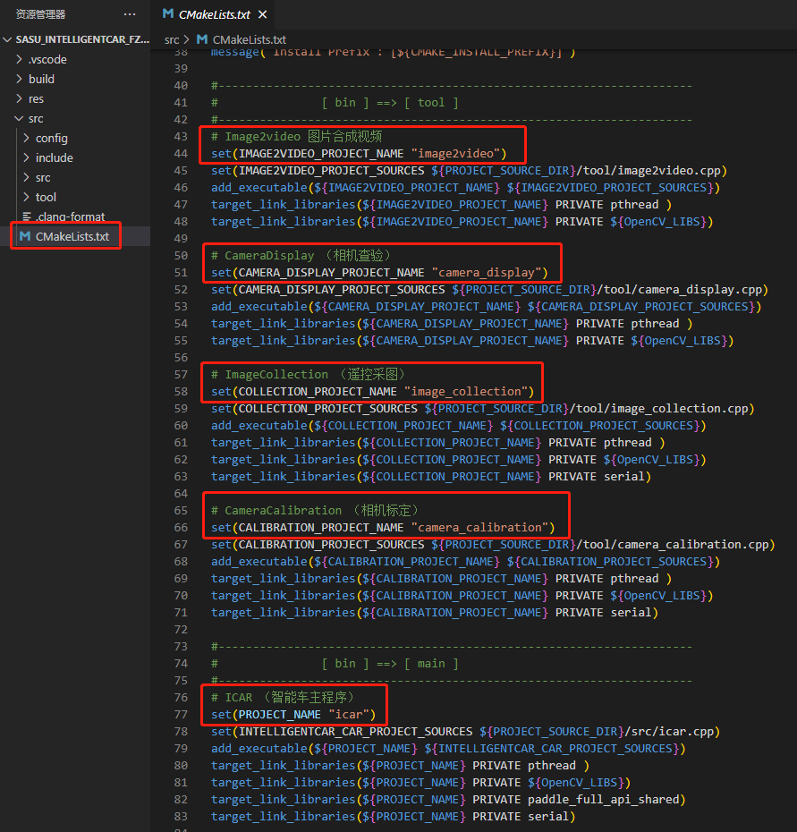
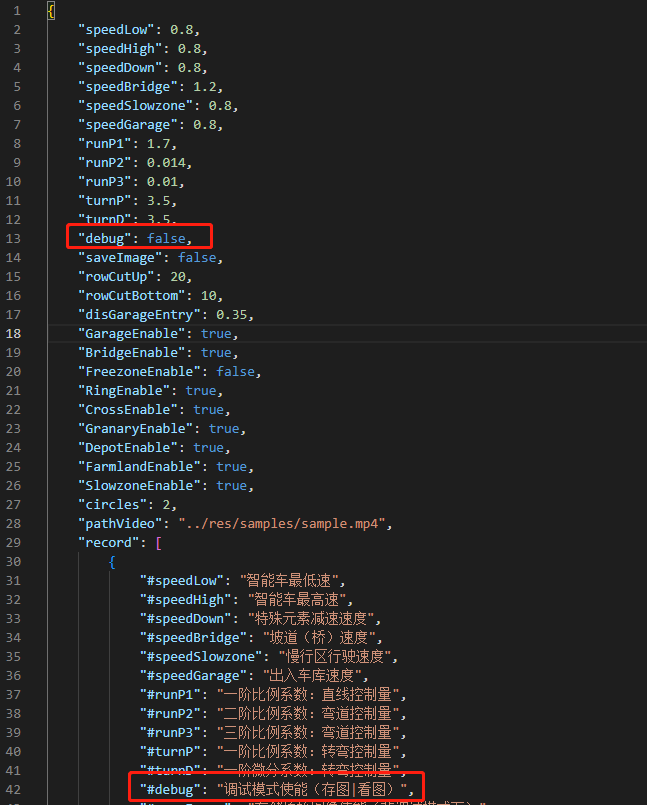
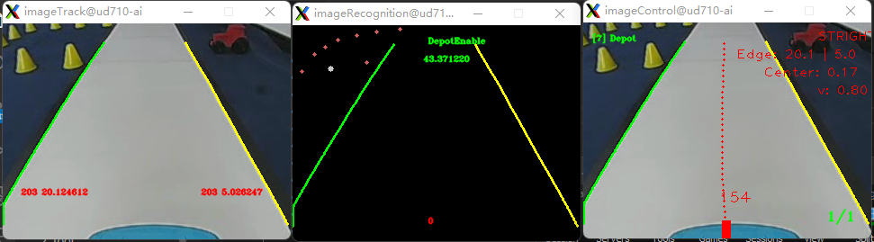
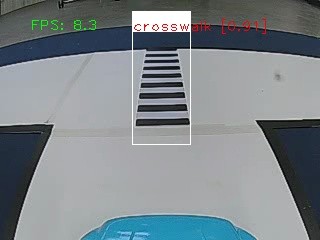
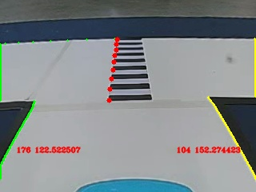
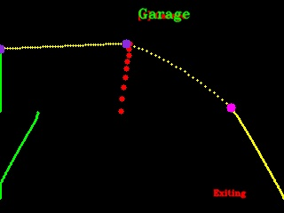
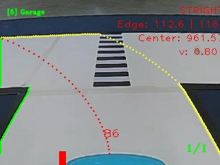
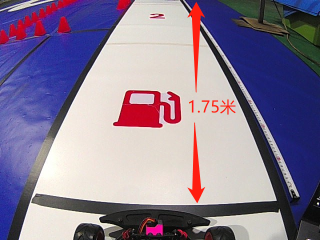

# Intelligentcar2023-FZ3B

#### 介绍
全国大学生智能汽车竞赛 - [赛曙科技]开源软件工程，基于百度Edgeboard-FZ3B赛事教育版边缘计算板卡开发，

严肃声明！！该软件方案仅限智能汽车竞赛学习交流，本人基于智能车爱好者维度向公众公开源代码，不涉及任何商业行为，请全体技术爱好者共同监督指导！！！

此工程包含完全模型组2023年“智慧农业”主题完整代码示例，相关演示视频请查看具体链接。


#### 软件架构



#### 使用说明

1. 该软件工程基于C++/OpenCV2/Python3.7/PaddlePaddle-Detection搭建；

2. 基于百度智能汽车-完全模型组及赛事开源Edgeboard板卡FZ3B调试开发；

3. 默认将该软件下载到EB：root@EdgeBoard:~/workspace目录下即可启用；

4. 除此之外，该软件支持Debug仿真调试（视频）/比赛模式两种方式运行；

   

#### 文件目录


#### 下位机说明

​		请注意：该代码工程需配合赛曙科技开源智控板（CarDo）使用，用户也可按照开源协议准备自己的下位机，通过USB转串口协议联合使用。


#### 程序启动说明

1. 编译代码/CMake

   

   ​		如上图所示CMakeLists.txt文件：本工程包含智能车主程序和其它可被编译运行的程序，用户编译后执行，编译步骤如下：

   ​		cd到工程build路径下，执行 

   ```
   sudo cmake ../src/
   ```

   

   ​		编译代码 ：

   ```
   sudo make icar -j
   ```

   

   

2. 配置文件（config）修改：

   ​		方便比赛调试，本工程摘取重要参数关联至motion.json文件，用户在调试过程直接修改配置文件，无需编译代码即可运行。

   ​		其中，可通过debug标志启动仿真（跑视频）模式和比赛（竞速）模式，仿真模式下默认调取本地视频（`"pathVideo": "../res/samples/sample.mp4"`），并且通过远程桌面观察实时图像和运算结果；比赛模式将关闭图像显示和图形绘制（省时10ms）。

   ​		另外，包括智能车速度、姿态模型参数、赛道元素使能等关键参数，用户按照配置文件详细说明修改。

   

   ​		修改motion.json文件后，不必再次编译即可运行，方便后期调试。可通过debug标志启动仿真（跑视频）模式和比赛（竞速）模式，仿真模式下默认调取本地视频，并且通过VNC观察实时图像运算结果；比赛模式将关闭图像显示和图形绘制（省时间/10ms）。

   

3. 连接下位机，启动程序

   运行icar程序需要连接下位机，否则程序退出，插入ch340/cp2102的USB串口即可（或注释串口程序）。

   

   

4. 查看运行结果（debug模式）

   

   

5. 开始比赛（竞赛模式）

   ​		脱机运行：小车在赛道上奔跑时可通过 "nohup" 命令启动程序，此时拔掉网线继续运行。

   

   ​		若程序无法自行退出，待重新插上网线后，通过Ctrl+C终止进程，或者查询当前进程ID：

   ```
   ps -ef|grep ./icar
   ```

   ​		然后杀掉当前进程（kill -9 ID）。

   

   


#### 图像处理思路

相机采图 → 图像校正 → AI预处理 → 赛道识别（Track） → 特殊元素识别（Rec/Det） →  路径拟合  → 运动控制模型计算 → 下位机通信：













#### I车模配置

1. 摄像头前瞻距离：1.6~2.2米（推荐1.75m）

   

   


2. 下位机设计PID模型/电机模型-控速，控制单位：m/s (float)
3. 下位机舵机控制，TIM/定时器计数上限20000，频率50Hz，占空比控制阈值[500，2500]。上位机理论控制阈值[1100, 1500, 1900] / 左|中|右，舵机中值及左右阈值在实际的标定值上偏移。